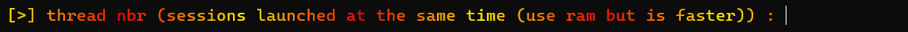
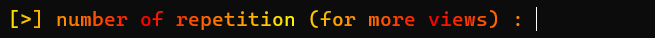

youtube-views
==========

### add views in your videos

# Introduction
_youtube-views_ est un programme coder en [**python**](https://www.python.org/) qui permet d'accelerer le gain de vue. Il utilise les performances de votre machine en utilisant le _multi-threading_ (module [**threaded**](https://pypi.org/project/threaded/)) pour plus de d'efficacité.

# Installation

## Source code
> [**git**](https://git-scm.com/) et [**python3**](https://www.python.org/) et **pip** sont requis pour l'installation

Pour commencer, télechargez le répositorie avec 

`git clone https://github.com/deepcaps/youtube-views.git`

Déplacez-vous dans le répertoire créé puis effectuez cette commande pour installer les modules necessaires

`pip install -r requirements.txt`

> `python3 -m pip install pip` pour installer **pip**

Démarez ensuite le programme avec

`python3 bot.py`

## Windows executable
Télechargez [_l'executable windows_](https://github.com/deepcaps/youtube-views/releases/tag/untagged-063e3bb6aa5304817f57) puis executez le simplement sans installation
> L'executable n'est peut être pas avec la dernière version du bot

# How to use

Après avoir installé et lancé le bot (voir [Installation](#installation)), appuyez sur `[ENTER]` pour le démarer

Pour la première options (_link of the video_), vous devez simplement entrer le lien de la vidéo qui va être ciblée.

Ensuite, pour la deuxième options (_watch time_), vous devez indiquez le temps que le bot restera sur la vidéo **en secondes**.
> Plus le bot reste longtemps, plus la vidéo sera référencé

Pour la troisième option (_thread nbr_), vous devez entrer **un entier** qui correspondra au nombre de session lancé simultanément. Plus le chiffre est élevé, plus il y aura de vues rapidement mais plus cela utilisera de la **RAM**.
> La valeur recommendée est **5** pour un pc moyen (8 go de RAM) mais cela dépend de votre utilisation et de vos performances.

Pour finir, pour la dernière option (_repetion nbr_), vous devez indiquer le nombre de boucle que va faire le programme. Cette options n'utilise pas de performances supplémentaires contrairement à _thread nbr_
> Vous pouvez terminer le programme avant la fin des répétitions avec le racourcie _CTRL + C_

Le programme effectura un **test de connexion** sur l'hote _www.youtube.com_ et vous calculera ensuite une estimation des vues que cela vous rapporteras et du temps que cela va prendre.
> Le temps peut varier en fonction des **performances** de votre machine et de l'évolution de votre **vitesse de connexion**

# To know
Le projet est un bot créé par **@deepcaps** avec [selenium](https://selenium-python.readthedocs.io/).

Aucune donnés n'est enregistrées.

Les librairies utilisées sont:
- colorama
- selenium
- platform
- time
- threaded
- os
- pystyle

# Me contacter
Vous pouvez me contacter a l'adresse [**deepcaps@outlook.com**](deepcaps@outlook.com) pour me faire parvenir les bugs ou les fonctionnalités à rajouter.

# Infos

