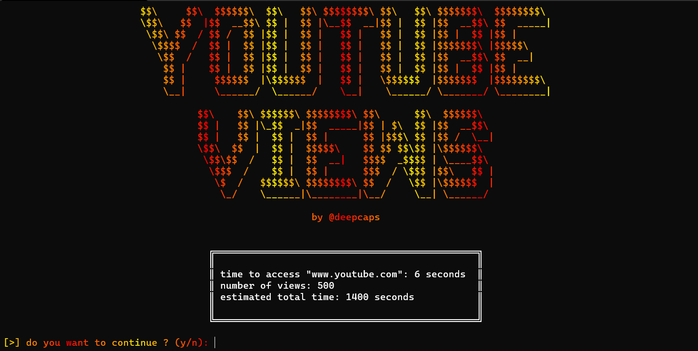

youtube-views
==========
### add views in your videos

# Introduction
_youtube-views_ est un programme coder en [**python**](https://www.python.org/) qui permet d'accelerer le gain de vue. Il utilise les performances de votre machine en utilisant le _multi-threading_ (module [**threaded**](https://pypi.org/project/threaded/)) pour plus de d'efficacité.

# Installation
## Source code
> [**git**](https://git-scm.com/) et [**python3**](https://www.python.org/) et **pip** sont requis pour l'installation

Pour commencer, télechargez le répositorie avec 

`git clone https://github.com/deepcaps/youtube-views.git`

Déplacez-vous dans le répertoire créé puis effectuez cette commande pour installer les modules necessaires

`pip install -r requirements.txt`

> `python3 -m pip install pip` pour installer **pip**

Démarez ensuite le programme avec

`python3 bot.py`

## Windows executable
Télechargez [_l'executable windows_](https://github.com/deepcaps/youtube-views/releases/tag/untagged-063e3bb6aa5304817f57) puis executez le simplement sans installation
> L'executable n'est peut être pas avec la dernière version du bot

